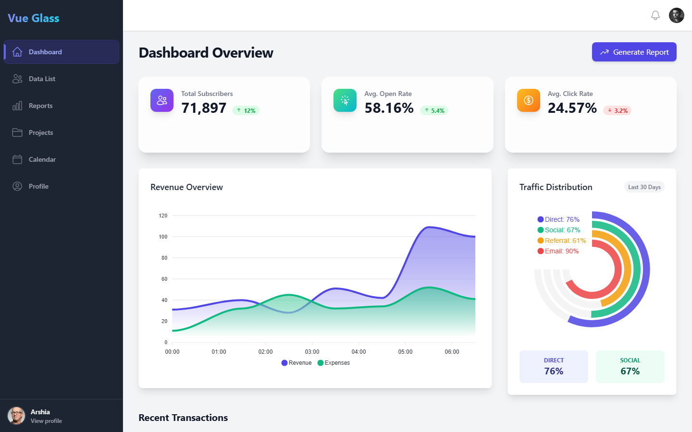
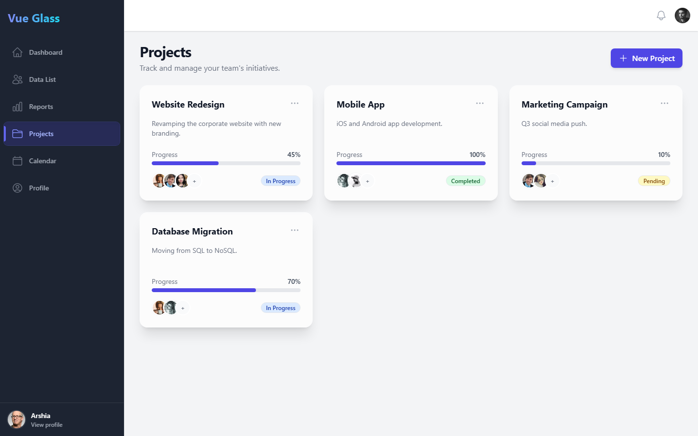

# Vue Glass Dashboard

[](https://github.com/Arshiamk/vue-glass-dashboard/actions/workflows/ci.yml)


A responsive admin dashboard built with Vue 3, Vite, and Tailwind CSS, featuring a glassmorphism-inspired design, interactive ApexCharts visualizations, and a mock authentication flow with route guards.

## Screenshots

| Dashboard | Projects |
| --- | --- |
|  |  |

## Features

- **Dashboard overview** – KPI stat cards with trend indicators, a revenue area chart, a traffic distribution radial chart, and a recent transactions feed
- **Reports** – financial performance and user growth charts powered by ApexCharts
- **Data table** – remote data fetched with Axios (JSONPlaceholder), with client-side search, pagination, loading skeletons, and an error state
- **Projects board** – card-based project tracking with progress bars, status badges, and team avatars
- **Calendar** – month-grid view with sample events
- **Profile page** – editable user profile backed by the auth store
- **Mock authentication** – login form (any non-empty credentials), session persisted in `localStorage`, and Vue Router navigation guards protecting the app routes
- **Toast notifications** – lightweight global feedback system built on a shared composable
- **Responsive layout** – off-canvas sidebar on mobile, fixed sidebar on desktop

## Tech Stack

- [Vue 3](https://vuejs.org/) (Composition API, `<script setup>`)
- [Vite 7](https://vite.dev/)
- [Pinia](https://pinia.vuejs.org/) for state management
- [Vue Router 4](https://router.vuejs.org/) with navigation guards
- [Tailwind CSS 3](https://tailwindcss.com/)
- [ApexCharts](https://apexcharts.com/) via vue3-apexcharts
- [Heroicons](https://heroicons.com/)
- [Vitest](https://vitest.dev/) + [Vue Test Utils](https://test-utils.vuejs.org/) for unit and component tests

## Quick Start

Requires Node.js 20.19+ (or 22.12+).

```bash
# Clone the repository
git clone https://github.com/Arshiamk/vue-glass-dashboard.git
cd vue-glass-dashboard

# Install dependencies
npm install

# Start the development server
npm run dev
```

Open the printed local URL and sign in with any username and password (authentication is mocked for demo purposes).

### Other Scripts

```bash
npm test         # Run the Vitest suite
npm run build    # Production build
npm run preview  # Preview the production build locally
```

## Testing

Unit and component tests live in `tests/` and cover:

- the auth store (login, rejection of empty credentials, logout)
- the data store (fetching and mapping remote data, error handling)
- router navigation guards (redirects for guests and authenticated users)
- the header profile dropdown, including its click-outside behavior

Continuous integration runs the test suite and a production build on every push and pull request via GitHub Actions.

## Project Structure

```
src/
├── components/    # Header, Sidebar, charts, toasts
├── composables/   # useToast, useClickOutside
├── layouts/       # Authenticated dashboard shell
├── router/        # Routes and navigation guards
├── stores/        # Pinia stores (auth, data)
└── views/         # Login, Dashboard, Data, Reports, Projects, Calendar, Profile, 404
```

## Author

**Arshia Mirshekar** – [@Arshiamk](https://github.com/Arshiamk)

## License

This project is licensed under the MIT License – see the [LICENSE](LICENSE) file for details.
